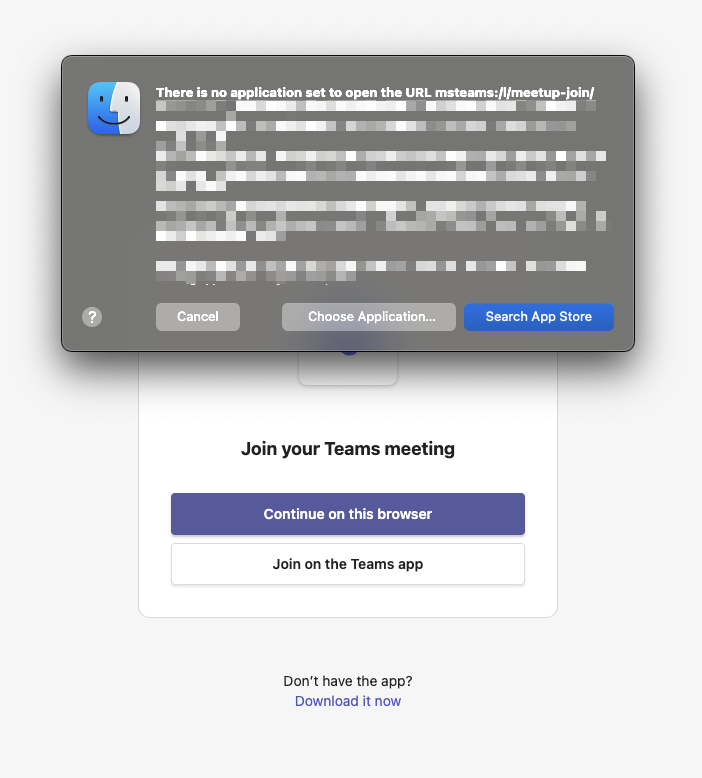

# MacOS fix missing application errors in Chrome

A collection of scripts and documentation on fixing MacOS browser errors like "There is no application set to open the ..." example Microsoft Teams:

Each sub folder links to the application and a script that can automatically fix it for you, or
how to do it manually.

⚠️ You take on all risks and issues for any modifications to your system whether automatically through scripts in this repository or manually fixed. No support will be given.
